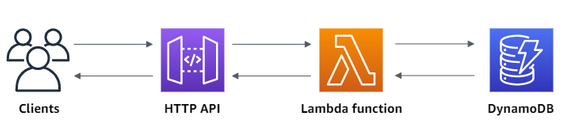

<!-- BEGIN_TF_DOCS -->
## DevOps Engineering Challenge



## Prerequisites
- The Terraform CLI (1.0.1+) installed.
- An AWS account.
- The AWS CLI (2.0+) installed, and configured for your AWS account.

### how to deploy in prod environment

#### Clone the repo
```sh
git clone https://github.com/wiliscavalcante/devops-engineering-challenge.git
```
#### Acess the terraform folder
```sh
cd devops-engineering-challenge/terraform
```
#### Initialize the terraform configuration
```sh
terraform init
```
#### Apply the configuration
```sh
terraform apply
```
> to test, take the output url and open in browser

#### Clean up your infrastructure
```sh
terraform destroy
```


### how to deploy in dev environment

#### Switch to branch dev
```sh
git checkout dev
```
#### Initialize the terraform configuration
```sh
terraform init
```
#### Apply the configuration
```sh
terraform apply
```
> to test, take the output url and open in browser 

#### Clean up your infrastructure
```sh
terraform destroy
```


## Requirements

| Name | Version |
|------|---------|
| <a name="requirement_terraform"></a> [terraform](#requirement\_terraform) | >= 1.0, < 2.0 |
| <a name="requirement_aws"></a> [aws](#requirement\_aws) | 4.36.1 |

## Providers

| Name | Version |
|------|---------|
| <a name="provider_archive"></a> [archive](#provider\_archive) | 2.2.0 |
| <a name="provider_aws"></a> [aws](#provider\_aws) | 4.36.1 |

## Modules

No modules.

## Resources

| Name | Type |
|------|------|
| [aws_apigatewayv2_api.api-gw-hello](https://registry.terraform.io/providers/hashicorp/aws/4.36.1/docs/resources/apigatewayv2_api) | resource |
| [aws_apigatewayv2_integration.lambda_hello](https://registry.terraform.io/providers/hashicorp/aws/4.36.1/docs/resources/apigatewayv2_integration) | resource |
| [aws_apigatewayv2_route.get_hello](https://registry.terraform.io/providers/hashicorp/aws/4.36.1/docs/resources/apigatewayv2_route) | resource |
| [aws_apigatewayv2_stage.request](https://registry.terraform.io/providers/hashicorp/aws/4.36.1/docs/resources/apigatewayv2_stage) | resource |
| [aws_dynamodb_table.this](https://registry.terraform.io/providers/hashicorp/aws/4.36.1/docs/resources/dynamodb_table) | resource |
| [aws_dynamodb_table_item.this](https://registry.terraform.io/providers/hashicorp/aws/4.36.1/docs/resources/dynamodb_table_item) | resource |
| [aws_iam_policy.dynamo](https://registry.terraform.io/providers/hashicorp/aws/4.36.1/docs/resources/iam_policy) | resource |
| [aws_iam_role.dynamo](https://registry.terraform.io/providers/hashicorp/aws/4.36.1/docs/resources/iam_role) | resource |
| [aws_iam_role_policy_attachment.dynamo](https://registry.terraform.io/providers/hashicorp/aws/4.36.1/docs/resources/iam_role_policy_attachment) | resource |
| [aws_lambda_function.dynamo](https://registry.terraform.io/providers/hashicorp/aws/4.36.1/docs/resources/lambda_function) | resource |
| [aws_lambda_permission.api_gw](https://registry.terraform.io/providers/hashicorp/aws/4.36.1/docs/resources/lambda_permission) | resource |
| [archive_file.dynamo](https://registry.terraform.io/providers/hashicorp/archive/latest/docs/data-sources/file) | data source |
| [aws_iam_policy_document.dynamo](https://registry.terraform.io/providers/hashicorp/aws/4.36.1/docs/data-sources/iam_policy_document) | data source |
| [aws_iam_policy_document.lambda-assume-role](https://registry.terraform.io/providers/hashicorp/aws/4.36.1/docs/data-sources/iam_policy_document) | data source |

## Inputs

| Name | Description | Type | Default | Required |
|------|-------------|------|---------|:--------:|
| <a name="input_aws_profile"></a> [aws\_profile](#input\_aws\_profile) | Profile Account | `string` | `"default"` | no |
| <a name="input_aws_region"></a> [aws\_region](#input\_aws\_region) | AWS Region | `string` | `"us-east-1"` | no |
| <a name="input_env"></a> [env](#input\_env) | n/a | `string` | `"prod"` | no |

## Outputs

| Name | Description |
|------|-------------|
| <a name="output_hello_base_url"></a> [hello\_base\_url](#output\_hello\_base\_url) | n/a |
<!-- END_TF_DOCS -->